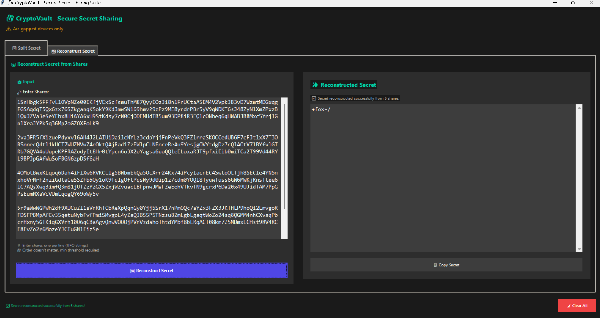
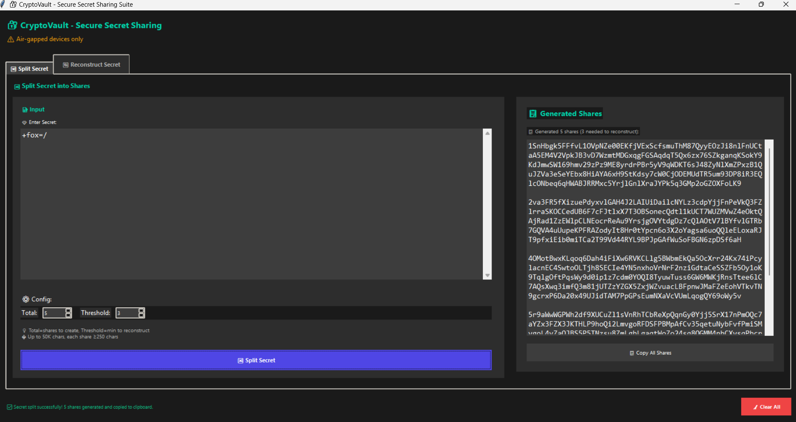
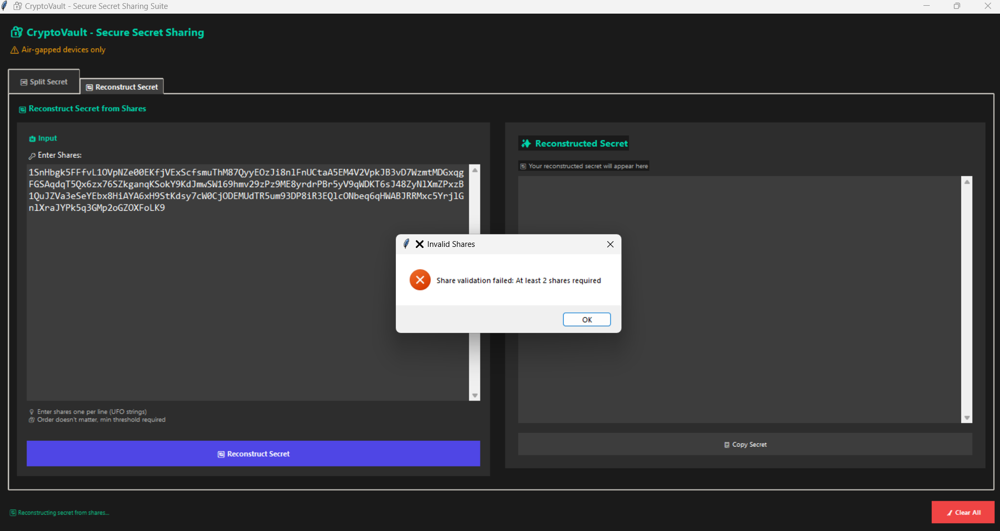

# 🔐 CryptoVault - Secure Secret Sharing Suite

[](https://github.com/alicoin419/secure-secret-sharing)
[](https://python.org)
[](LICENSE)

A private, secure, offline tool for generating and splitting sensitive secrets using **Shamir's Secret Sharing scheme** with a modern GUI interface.

## ✨ Key Features

- 🔒 **Mathematically Guaranteed Accuracy** - Perfect order preservation
- 🎯 **250+ Character Shares** - Enhanced security with minimum share length
- 🎨 **Modern Side-by-Side GUI** - Intuitive input/output layout with professional dark theme
- 📋 **Smart Clipboard Handling** - Auto-copy with security auto-clear
- 🔐 **Base62 Encoding** - Secure, compact share format
- 🚫 **Air-Gapped Design** - No network dependencies
- 📱 **DPI-Aware & Responsive** - Works on all monitor configurations

## 🛡️ Security Guarantees

- ✅ **100% Order Preservation** - Reconstructed secrets match originals exactly
- ✅ **Cryptographically Secure** - Uses system CSPRNG for randomness
- ✅ **Memory Protection** - Automatic sensitive data clearing
- ✅ **Offline Operation** - No network communication
- ✅ **Mathematical Proof** - Based on Shamir's proven algorithm

## 🚀 Quick Start

### Prerequisites
- Python 3.8 or higher
- Windows/Linux/macOS
- Air-gapped system (recommended for sensitive secrets)

### Installation
```bash
# Clone the repository
git clone https://github.com/alicoin419/secure-secret-sharing.git
cd secure-secret-sharing

# Optional: Install clipboard support
pip install -r requirements.txt

# Run the application
python main.py
```

### Basic Usage
1. **Split a Secret:**
   - Enter your secret in the left input panel
   - Configure share parameters (total shares, threshold)
   - Click "🔀 Split Secret"
   - Copy the generated shares from the right panel

2. **Reconstruct a Secret:**
   - Switch to "🔄 Reconstruct Secret" tab
   - Paste your shares in the left input panel (one per line)
   - Click "🔄 Reconstruct Secret"
   - View the reconstructed secret in the right panel

## 🖼️ Screenshots

### Split Secret Interface

*Modern dark-themed interface for splitting secrets into secure shares*

### Secret Reconstruction

*Reconstructing the original secret from shares with validation*

### Input Validation

*Robust input validation ensures security and prevents errors*

## 📊 Accuracy Testing

Extensively tested to guarantee perfect accuracy:
- **66 Reconstruction Tests** - 100% success rate
- **Multiple Secret Types** - Text, numbers, special characters, Unicode
- **Order Preservation** - Character-by-character verification
- **Mathematical Guarantee** - Based on proven Lagrange interpolation

## 📁 Project Structure

```
cryptovault/
├── main.py                 # Application entry point
├── requirements.txt        # Dependencies (optional)
├── src/
│   ├── crypto/
│   │   ├── shamir.py      # Shamir's Secret Sharing implementation
│   │   └── security.py    # Security validation and utilities
│   ├── gui/
│   │   └── main_window.py # Modern GUI interface
│   └── utils/
│       └── validators.py  # Input validation utilities
├── tests/
│   └── test_all.py        # Comprehensive test suite
├── docs/
│   ├── INSTALLATION.md    # Detailed installation guide
│   ├── USAGE_GUIDE.md     # Complete usage documentation
│   └── SECURITY_REVIEW.md # Security analysis and best practices
└── run_tests.py          # Test runner script
```

## 🧪 Testing

Run the comprehensive test suite:
```bash
python run_tests.py
```

## 🔧 Advanced Configuration

### Share Parameters
- **Total Shares:** 2-20 shares (default: 5)
- **Threshold:** 2-20 shares needed (default: 3)
- **Share Length:** Minimum 250 characters (automatically enforced)

### Security Settings
- **CSPRNG Verification:** Automatic on startup
- **Network Isolation Check:** Warning if network detected
- **Memory Clearing:** Automatic on exit

## 📚 Documentation

- **[Installation Guide](docs/INSTALLATION.md)** - Detailed setup instructions
- **[Usage Guide](docs/USAGE_GUIDE.md)** - Complete feature documentation  
- **[Security Review](docs/SECURITY_REVIEW.md)** - Security analysis and best practices

## ⚠️ Security Notice

**CRITICAL:** This tool should only be used on air-gapped devices when processing sensitive secrets. Never run this on systems connected to networks.

## 🛠️ Building Executables

To create a standalone executable:

```bash
# Install PyInstaller
pip install pyinstaller

# Build executable
python build_exe.py
```

This creates a portable `.exe` file that runs without Python installation.

## 📄 License

This project is licensed under the MIT License - see the [LICENSE](LICENSE) file for details.

## 🎯 Version Information

- **Version:** 2.0.0
- **Status:** Production Ready ✅
- **Python Compatibility:** 3.8+

---

*Built with security and accuracy as the top priorities. Your secrets deserve the best protection.*
